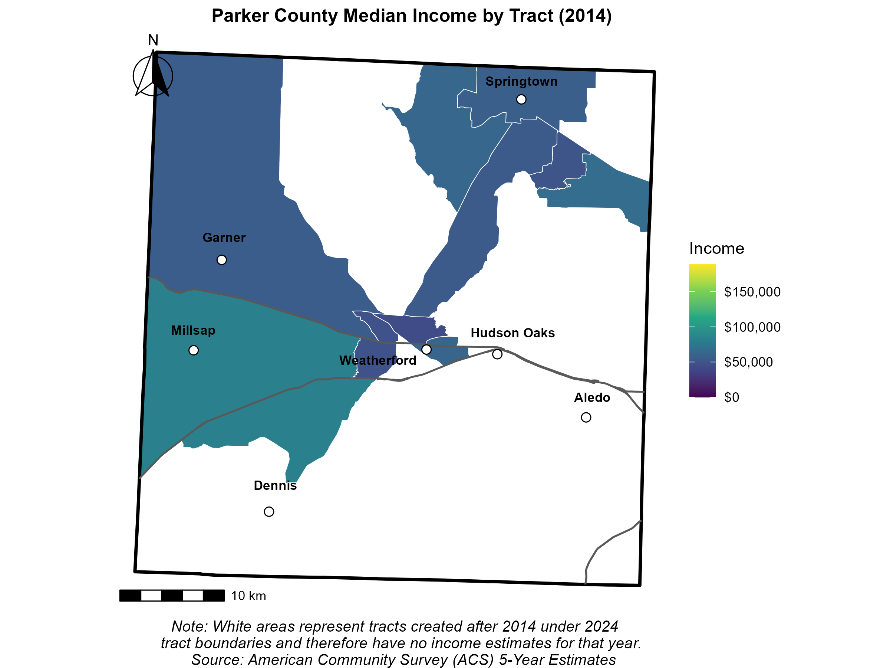
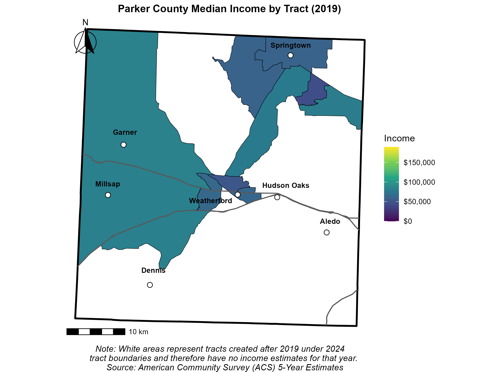
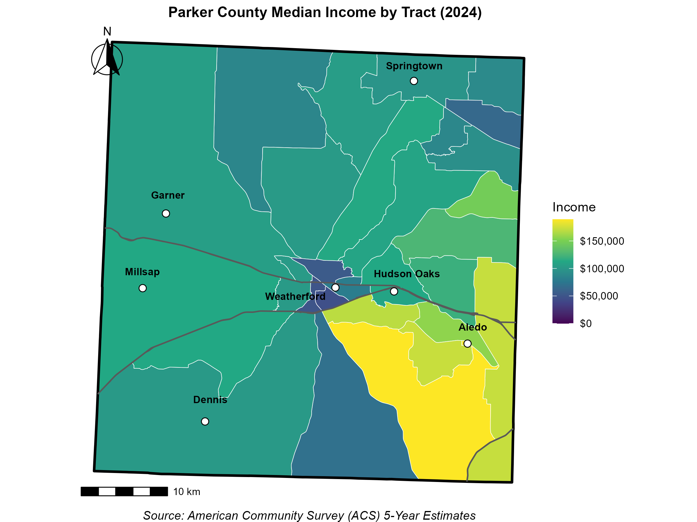
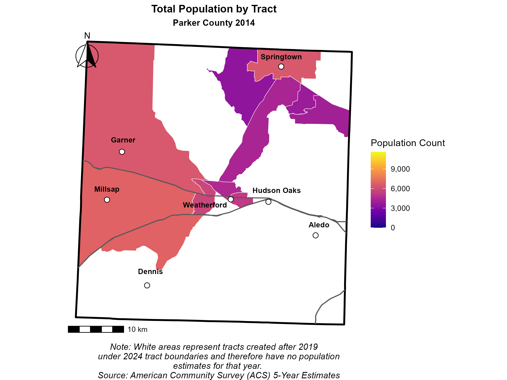
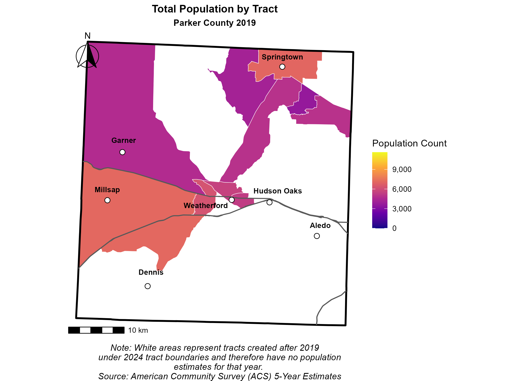
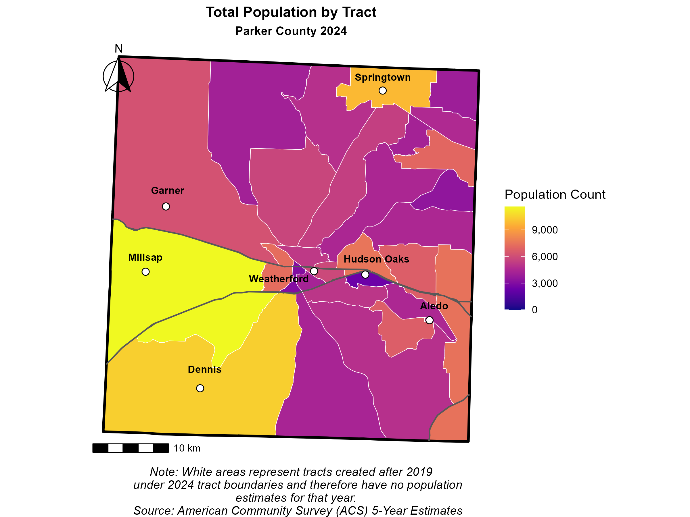
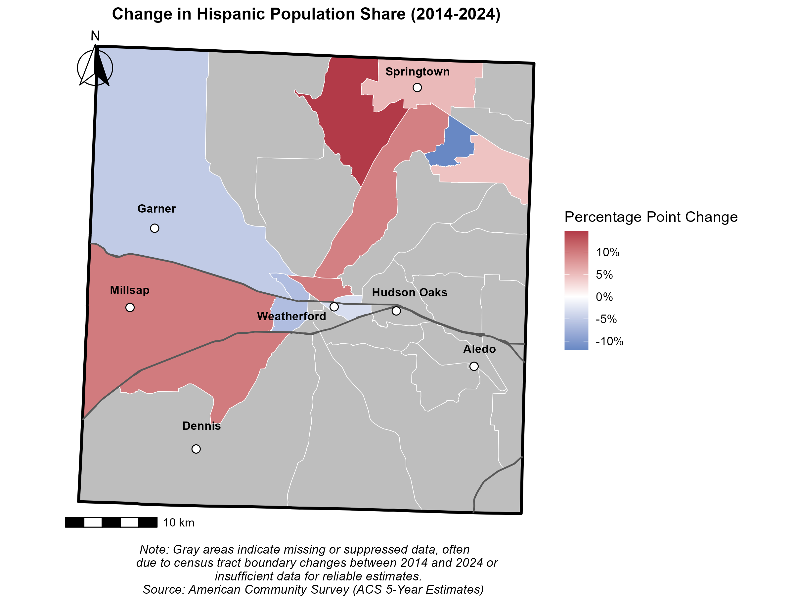
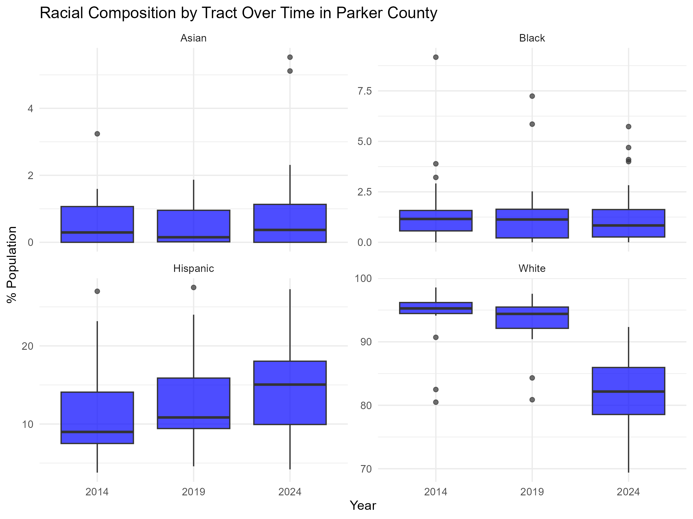
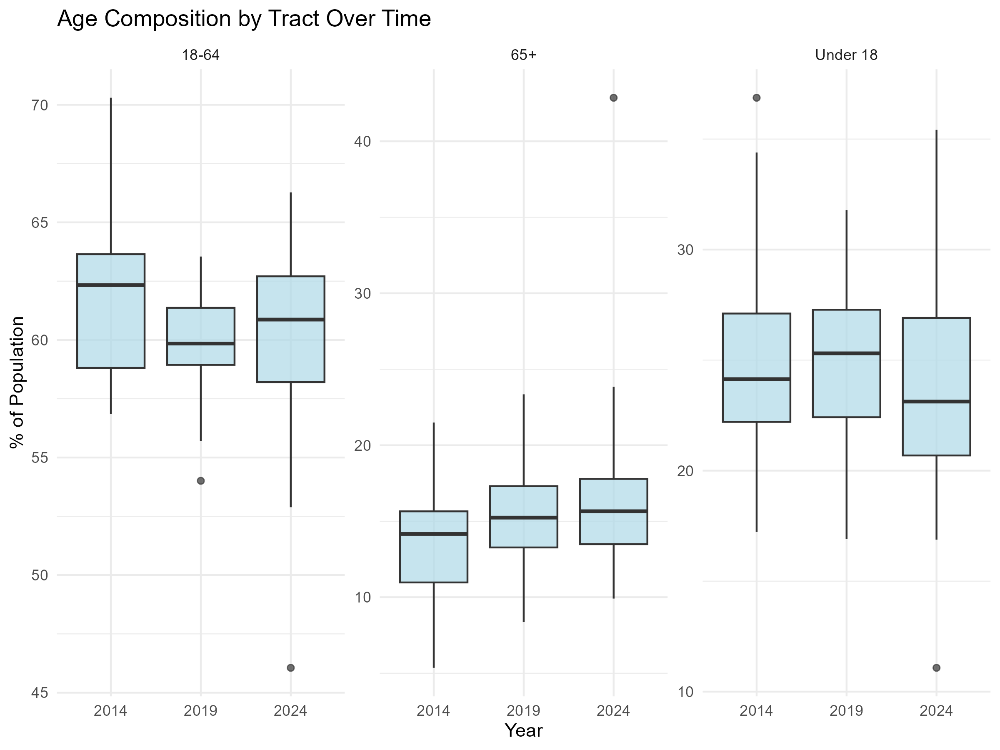
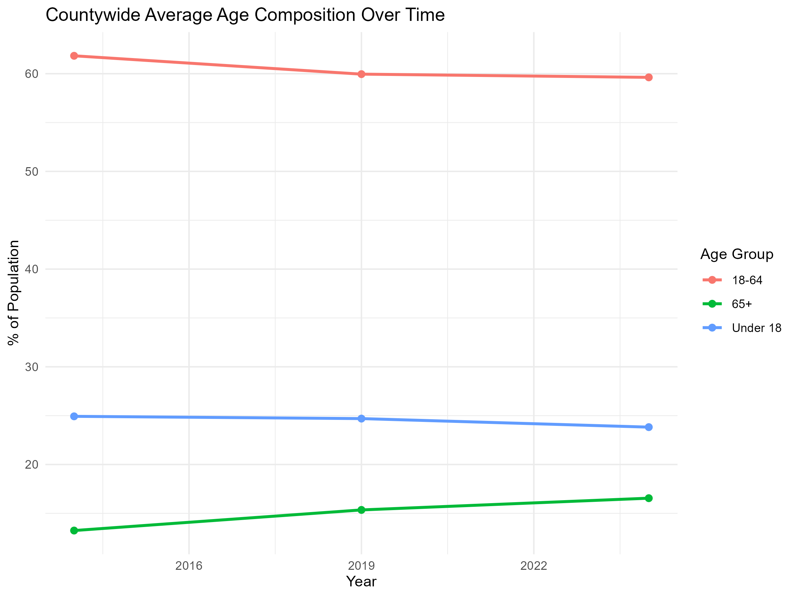

```{r setup, include=FALSE}
knitr::opts_chunk$set(echo = TRUE)

library(kableExtra)
```

## Summary
This project examines demographic and economic change at the census tract level in Parker County, Texas between 2014 and 2024 using American Community Survey (ACS) data.

The analysis focuses on identifying spatial patterns in income growth, population expansion, and demographic change to better understand how the county is evolving over time.

## Key Findings
- Median household income increased across most tracts, with widening disparities between high- and low-income areas.
- Population growth accelerated after 2019 and concentrated in eastern and southeastern areas.
- The Hispanic population share increased across much of the county.
- The population is gradually aging, with growth in the 65+ population.
- Spatial inequality is increasing alongside suburban expansion.

Together, these findings indicate that Parker County is undergoing rapid suburban transformation characterized by economic growth, demographic diversification, and increasing spatial stratification.

----------------------------------------------------

## 1. Introduction & Purpose
Parker County, Texas has experienced rapid growth over the past decade, accompanied by visible changes in housing development, infrastructure, and community composition. While population increases and new developments are frequently highlighted, these narratives often lack a detailed, tract-level perspective on where and how changes are occurring.

This project analyzes demographic and economic change at the census tract level between 2014 and 2024 using American Community Survey (ACS) data. 

###### The goal is to provide a data-driven understanding on how Parker County is evolving by examining:
  - Median household income growth, identifying where incomes are rising or stagnating
  - Population growth and distribution, highlighting areas of concentrated expansion
  - Racial and ethnic shifts
  - Age structure trends, including patterns of aging and youth population changes
  
By combining spatial visualization with tract-level analysis, this report highlights both the areas of rapid growth and emerging inequalities shaping the county. Overall, the analysis reveals patterns of economic upgrading, demographic diversification, and suburban expansion.

## 2. Data Sources
  - American Community Survey (ACS) 5-Year Estimates (2014, 2019, 2024)
  - U.S. Census TIGER/Line Shapefiles

##### Variables Used:
  - Median household income
  - Total population
  - Age distribution
  - Racial/ethnic composition
  - School enrollment

## 3. Tools & Methods

#### Tools & Packages
  - R / RStudio
  - tidyverse
  - tidycensus
  - sf
  - tigris
  - ggplot2
  - ggspatial
  - scales

#### Methods
1. Data Collection
    - Retrieved tract-level ACS data via API for 2014, 2019, and 2024
    - Ensured reproducibility through scripted queries
2. Data Cleaning & Validation  
    - Harmonized variables across years
    - Addressed missing values and inconsistencies
    - Verified tract-level structure and geometry
3. Exploratory Data Analysis (EDA)
    - Generated summary statistics
    - Examined distributions & trends
    - Created line plots and boxplots
4. Spatial Analysis & Visualization
    - Produced tract-level maps of income, population, and demographic change
    - Added contextual layers (roads, cities, county boundaries)
    - Created side-by-side comparisons across years


## 4. Results

### Income Growth
Median household income increased substantially across nearly all census tracts between 2014 and 2024. The overall distribution shifted upward, with the most significant gains occurring between 2019 and 2024.
By 2024, several tracts experienced increases exceeding $40,000-$60,000, while the gap between the highest- and lowest-income tracts widened considerably.

Income growth was not uniform. Higher-growth eastern and southeastern tracts experienced the largest gains, forming a clear spatial pattern of economic concentration.

Most tracts experienced positive income growth, though the magnitude varies widely. A small number of high-growth tracts account for a disproportionate share of total gains, highlighting emerging income disparities.

###### These patterns suggest:
  - Rapid economic upgrading in high-growth suburban corridors.
  - Increasing spatial inequality across the county.
  - Emerging economic stratification between regions.
 
If these current trends continue, Parker County may experience rising housing costs with rising property tax pressures, reduced affordability in high-growth areas and greater separation between rural western and affluent eastern tracts.




```{r income-graphs, fig.cap="Income Distribution Patterns", out.width="50%", fig.show="hold"}
knitr::include_graphics(c("../outputs/med_income_plot.png",
                          "../outputs/income_change_plot.png"))
```


### Population Growth
Total population increased steadily from 2014 to 2019 and accelerated significantly between 2019 and 2024.

Growth is concentrated tracts near the edge of the Dallas-Fort Worth metropolitan edge and significant growth is noted in some western tracts, reflecting outward suburban expansion.

The creation of new census tracts during this period highlights the scale of growth and indicates structural changes in the county's geographic organization.
 
###### These results suggest:
  - Growth is reshaping the county's spatial structure
  - Expansion is driven by metropolitan spillover
  - Infrastructure and housing demand are increasing rapidly.





### Demographic Shifts
The Hispanic population share increased across most tracts between 2014 and 2024, while the White population share declined proportionally.
Asian and Black population shares showed modest but consistent increases.
Variation across tracts also widened, indicating increasing demographic differentiation.

These results suggest that Parker County is becoming more demographically diverse, reflecting broader suburban diversification trends across Texas.

###### These shifts may influence:
  - School demographics
  - Community services
  - Local government priorities
  - Long-term political dynamics





### Age Distribution Patterns
The share of residents aged 65 and older increased steadily between 2014 and 2024, while the proportion under 18 and ages 18-64 declined slightly.
This pattern is consistent across both tract-level distributions and countywide averages.

###### These results suggest:
  - The population is gradually aging.
  - Demand for healthcare and senior services will likely increase.
  - Housing and infrastructure may need to adapt.
  - Slower youth growth may impact future school enrollment.





## 5. Overall Findings
Taken together, the results reveal a county undergoing accelerated suburban transformation.

###### Between 2014 and 2024, Parker County experienced:
  - Rapid population expansion
  - Significant income growth
  - Increasing spatial inequality
  - Rising demographic diversity
  - Gradual population aging

These trends indicate structural change rather than isolated shifts. Parker County is transitioning from a primarily rural county into a rapidly growing outer-ring suburban community shaped by metropolitan expansion. 

These patterns are supported by tract-level trend summaries (see Appendix).


## 6. Limitations
- Census tract boundaries change over time; this analysis uses 2024 boundaries for consistency.
- ACS estimates include sampling error not explicitly modeled.
- Some tracts contain missing or suppressed data.

## 7. Conclusion
Parker County is undergoing significant demographic and economic transformation. Growth is uneven, inequality is increasing, and the population is becoming more diverse and older.
These findings highlight how suburban expansion is reshaping communities at the local level and provide a foundation for understanding future challenges related to housing, infrastructure, and public services. 

----------------------------------------------------

## Appendix
### A1. Tract-Level Trend Summary
The following table reports tract-level averages for key variables across 2014, 2019, and 2024.
```{r}
trend_scan <- read.csv("../outputs/trend_scan.csv")

kableExtra::landscape(
  knitr::kable(trend_scan, format = "latex", booktabs = TRUE) %>%
    kable_styling(latex_options = "scale_down", font_size = 9)
)
``` 


## Disclaimer
This product uses the Census Bureau Data API but is not endorsed or certified by the Census Bureau.

## References:
- https://www.census.gov/programs-surveys/acs/data/data-via-api.html
- https://www.parkercountyedc.com/news
- https://www.census.gov/data/developers/data-sets/acs-5year.html
- https://www.census.gov/geographies/mapping-files/time-series/geo/tiger-line-file.html 
- https://fortworthreport.org/2024/08/18/fast-growing-parker-county-prepares-for-a-lot-more-change-with-arrival-of-uta-campus/#
- https://www.mckinsey.com/institute-for-economic-mobility/our-insights/small-towns-massive-opportunity-unlocking-rural-americas-potential 
- https://trerc.tamu.edu/article/can-texas-sustain-its-growth/#
- https://www.fox26houston.com/news/texas-immigration-report-2025 
